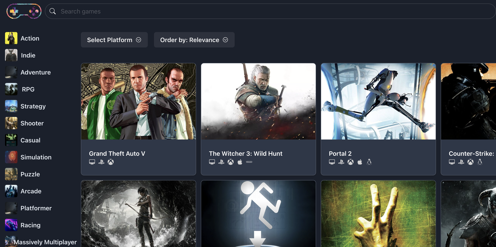

# Videogames Discovery

# Table of Contents

- Overview
- Technologies Used
- Features
- Screenshots
- Contributing
- Contact

## Overview

This is a videogame browser where users can select gaming platforms and genres dynamically and see the filtered results based on their selection.

The videogames come from a public external API Rawg

## Technologies Used

- React
- TypeScript
- Chakra UI
- React Icons

## Features

- **Dynamic Data Fetching:** Utilizes a custom hook (`usePlatforms`) to fetch and manage platform data.
- **Interactive UI Elements:** Implemented with Chakra UI for a responsive and aesthetically pleasing design.
- **State Management:** Manages selected platform state to update the UI in real-time.
- **Event Handling:** Updates state and passes selected platform data to parent components.
- **Icon Integration:** Uses React Icons (`IoChevronDownCircleOutline`) for intuitive visual cues.
- **Flexbox Layout:** Ensures consistent spacing and alignment of UI elements.

# Screenshots



# Contributing

If you want to contribute to this project, feel free to submit issues and pull requests. Please make sure to follow the existing code style and write tests for new features and bug fixes.

## Installation

1. Clone the repository:
   ```sh
   git clone https://github.com/yourusername/your-repo.git
   ```
2. Navigate to the project directory:
   ```sh
   cd your-repo
   ```
3. Install dependencies:
   ```sh
   npm install
   ```

## Usage

1. Start the development server:

````sh
   npm run dev
   ```
2. Open your browser and navigate to `http://localhost:5173/`.

````
